# 2021 8 10 springcloud

## 版本一定要对应上

```
   <spring-boot.version>2.3.2.RELEASE</spring-boot.version>
        <spring-cloud.version>Hoxton.SR8</spring-cloud.version>
        <spring-cloud-alibaba.version>2.2.3.RELEASE</spring-cloud-alibaba.version>
```


## idea 构建 阿里云想到初始化方式

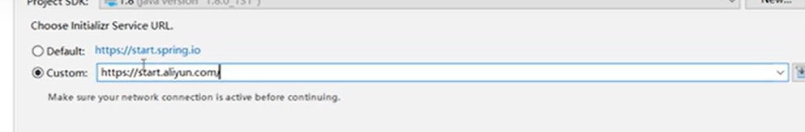


## 安装 nacos

```shell
#Clone 项目 https://nacos.io/zh-cn/index.html
git clone https://github.com/nacos-group/nacos-docker.git
cd nacos-docker

#单机模式 Derby
#将文件里面的版本改为 latest
docker-compose -f example/standalone-derby.yaml up

#其他模式
# https://nacos.io/zh-cn/docs/quick-start-docker.html

#登录页面
http://192.168.80.128:8848/nacos/#/login

```

springboot参数

保护阈值：你设置0.5 ，健康实例 / 总实例 < 0.5 ,他会把不健康的实例也拿来用。0的话就是不会把不健康的拿来用。

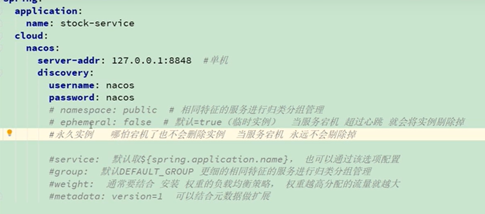

```yaml
server:
  port: 8010
spring:
  application:
    # nacos服务名
    name: app1-service
  cloud:
    nacos:
      server-addr: 192.168.80.128:8848
      discovery:
        username: nacos
        password: nacos
        # 服务列表 命名空间
        namespace: public
        # 永久实例 false 宕机了也不会删除实例 不是临时实例
        ephemeral: false
```


## nacos集群搭建

```shell
# 修改example/cluster-hostname.yaml 里面的版本号  latest
# 此配置是本机集群
docker-compose -f example/cluster-hostname.yaml up 

# 此配置是跨ip集群
docker-compose -f example/cluster-ip.yaml up 
#配置 互相发现ip 在这里
cat ../env/nacos-ip.env 


# 启动nginx
#docker-compose
version: "3.1"
services:
  nginx_nacos:
    container_name: "nginx_nacos"
    image: nginx
    ports:
      - 8838:8838
    volumes:
      - ./nginx.conf:/etc/nginx/nginx.conf
    network_mode: "host"

#nginx.conf
worker_processes  1;

events {
    worker_connections  1024;
}

http {
    include       mime.types;
    default_type  application/octet-stream;
    sendfile        on;
    client_max_body_size 500m;
    keepalive_timeout  1200;

	#后端地址
	upstream nacos{

		server 192.168.80.128:8848  weight=1 max_fails=2 fail_timeout=10s;
		server 192.168.80.128:8849  weight=1 max_fails=2 fail_timeout=10s;
		server 192.168.80.128:8850  weight=1 max_fails=2 fail_timeout=10s;

	}


    server{
        listen  8838;
        server_name 192.168.80.128;
        location / {
            proxy_pass http://nacos;
            proxy_set_header Host $host;
            proxy_set_header X-Real-IP $remote_addr;
            proxy_set_header X-Forwarded-For $proxy_add_x_forwarded_for;
            proxy_set_header REMOTE-HOST $remote_addr;
            add_header X-Cache $upstream_cache_status;
            add_header Cache-Control no-cache;
        }
    }
}
```


## openFeign

日志

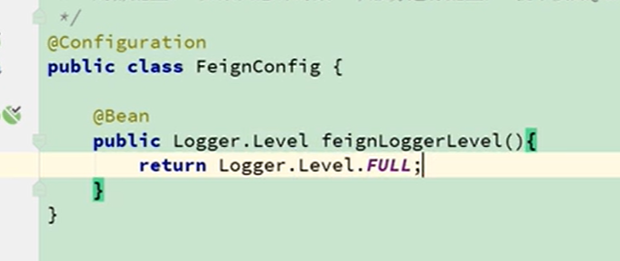

契约配置

超时配置

自定义拦截


## nacos配置中心

1.命名空间，配置环境

2.新建配置，group是项目名

3.克隆项目可以克隆不同环境

4.更多里面可以回滚版本

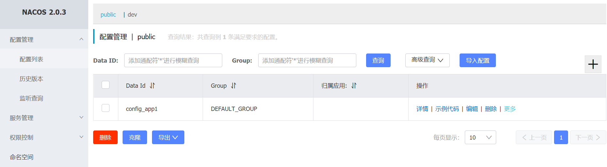

开启权限

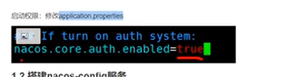


改单一配置

nacos配置

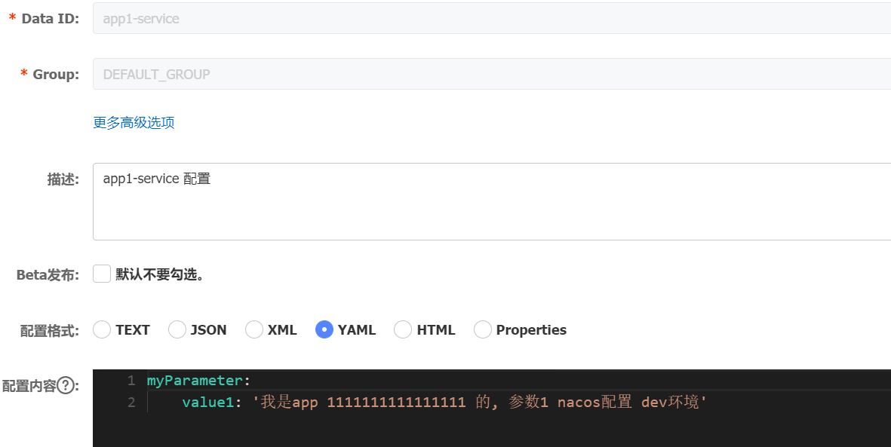

```yaml
#yaml
# 配置中心的配置写在这里
spring:
  cloud:
    nacos:
      server-addr: 192.168.80.128:8848
      username: nacos
      password: nacos
      config:
        namespace: dev
        # 扩展名
        file-extension: yaml
        # 禁用和启用 配置中心
        enabled: true


#java
// 测试gitee提交1
@SpringBootApplication
// nacos 客户端
@EnableDiscoveryClient
@EnableFeignClients //feign
public class App1Application {
    public static void main(String[] args) {
        ConfigurableApplicationContext run = SpringApplication.run(App1Application.class, args);
        String property = run.getEnvironment().getProperty("myParameter.value1");
        System.out.println("=================");
        System.out.println(property);
    }
}
```


profile配置

nacos配置中心 ，命名为：服务名-环境.扩展名，的方式。不建议这样，应该用命名空间作区分。

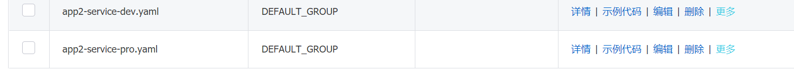

commons文件 要写在里面。

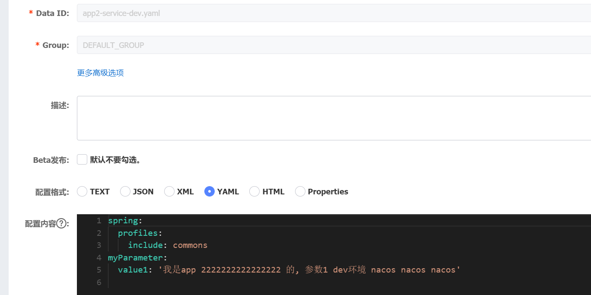

分类方式

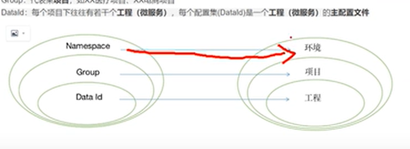

修改默认 dataid

data-id下标越大 优先级越高， refresh是是否刷新

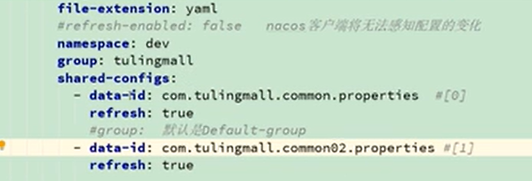

优先级最大的

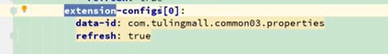

@value 无法感知修改之后的值


## sentinel

启动

```yaml
#docker run
docker run --name sentinel --restart=always -p 8858:8858 -d bladex/sentinel-dashboard 

#docker-compose
version: "3.1"
services:
  sentinel:
    container_name: "sentinel"
    image: bladex/sentinel-dashboard
    restart: always
    ports:
      - 8858:8858
```

 访问

http://192.168.80.128:8858/#/login

账号密码sentinel


被调用方 被调用之后出现在界面上

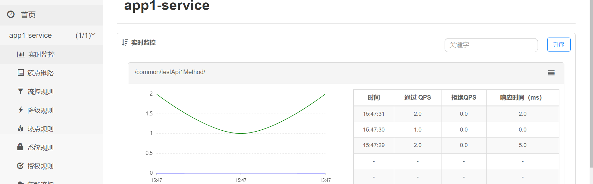


流控方式

1.qps流控方式

代码方式

```java
#pom
    <!--sentinel-->
        <dependency>
            <groupId>com.alibaba.csp</groupId>
            <artifactId>sentinel-core</artifactId>
        </dependency>
        <dependency>
            <groupId>com.alibaba.csp</groupId>
            <artifactId>sentinel-annotation-aspectj</artifactId>
        </dependency>
        
    
#java  直接定义
@RestController
public class ControllerTest {
    private static final String ruleName = "test1";
    @Autowired
    private Common2Api common2Api;

    @RequestMapping("test1")
    public Map test1(Map params) {
        Entry entry = null;
        try {
            entry = SphU.entry(ruleName);
            String str = "hello world";
            System.out.println("=====-==-----==");
            System.out.println(str);
        }catch (BlockException e1) {
        // 限流了
            System.out.println("block!");
            Map map2 = new HashMap();
            map2.put("block", "block");
            return map2;
        }catch (Exception ex) {
            Tracer.traceEntry(ex, entry);
        }finally {
            if (entry != null){
                entry.exit();
            }
        }


        Map map = new HashMap();
        map.put("调用者", "APP1");
        Map returnMap = common2Api.testApi2Method(map);
        return returnMap;
    }

    @PostConstruct
    private static void initFlowRules(){
        List<FlowRule> rules = new ArrayList<>();
        //流控
        FlowRule rule = new FlowRule();
        rule.setResource(ruleName);
        rule.setGrade(RuleConstant.FLOW_GRADE_QPS);
        rule.setCount(1);
        rules.add(rule);
        FlowRuleManager.loadRules(rules);
    }
}


#java 注解
   // 注解支持的配置Bean
    @Bean
    public SentinelResourceAspect sentinelResourceAspect() {
        return new SentinelResourceAspect();
    }
    
@RequestMapping(value = "test2")
    @SentinelResource(value = ruleName2, blockHandler = "blockHandlerForTest2")
    public String test2(){
        return "我是测试2";
    }

 @PostConstruct
    private static void initFlowRules(){
        List<FlowRule> rules = new ArrayList<>();
        //流控
        FlowRule rule = new FlowRule();
        rule.setResource(ruleName1);
        rule.setGrade(RuleConstant.FLOW_GRADE_QPS);
        rule.setCount(1);
        rules.add(rule);

        FlowRule rule2 = new FlowRule();
        rule2.setResource(ruleName2);
        rule2.setGrade(RuleConstant.FLOW_GRADE_QPS);
        rule2.setCount(1);
        rules.add(rule2);

        FlowRuleManager.loadRules(rules);
    }
```


2.并发线程流控方式


降级处理

```java
 // 测试降级
    /**
     * PS：这里有个需要注意的知识点，就是 SphU.entry 方法的第二个参数 EntryType 说的是这次请求的流量类型，共有两种类型：IN 和 OUT 。
     * IN：是指进入我们系统的入口流量，比如 http 请求或者是其他的 rpc 之类的请求。
     * OUT：是指我们系统调用其他第三方服务的出口流量。
     * 入口、出口流量只有在配置了系统规则时才有效。
     * 设置 Type 为 IN 是为了统计整个系统的流量水平，防止系统被打垮，用以自我保护的一种方式。
     * @return
     */
    @RequestMapping(value = "test3")
    @SentinelResource(value = degradeRule1, blockHandler = "blockHandlerForTest3", entryType = EntryType.IN)
    public String test3() {
        if (true) throw new RuntimeException("降级异常");
        return "我是测试3";
    }

    public String blockHandlerForTest3(BlockException ex) {
        ex.printStackTrace();
        return "降级了";
    }
    
    
    //降级规则
    @PostConstruct
    public void initDegradeRule() {
        List<DegradeRule> degradeRules = new ArrayList<>();
        DegradeRule degradeRule = new DegradeRule();
        degradeRule.setResource(degradeRule1);
        // 异常数降级
        degradeRule.setGrade(RuleConstant.DEGRADE_GRADE_EXCEPTION_COUNT);
        // 发生异常数
        degradeRule.setCount(2);
        // 多长时间内出现异常
        degradeRule.setStatIntervalMs(60 * 1000);
        // 时间窗口10s 这个时间内都降级，之后如果第一次就出错直接降级 不会根据条件判断了
        degradeRule.setTimeWindow(10);
        // 触发熔断的最少请求数
        degradeRule.setMinRequestAmount(2);
        degradeRules.add(degradeRule);
        DegradeRuleManager.loadRules(degradeRules);

    }
```


异常处理 被限流抛异常 熔断统一处理

blockexception 统一异常处理


各种规则

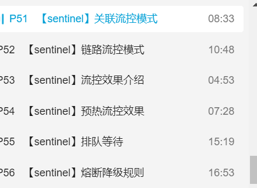


springboot 整合 openfeign

```yaml
#版本
  <spring-boot.version>2.3.2.RELEASE</spring-boot.version>
        <spring-cloud.version>Hoxton.SR8</spring-cloud.version>
        <spring-cloud-alibaba.version>2.2.3.RELEASE</spring-cloud-alibaba.version>
#feign
feign:
  sentinel:
    enabled: true
    
    
#pom
 <!--sentinel-->
 <dependency>
 <groupId>com.alibaba.cloud</groupId>
 <artifactId>spring-cloud-starter-alibaba-sentinel</artifactId>
 </dependency>
 
 #java
 package com.aki;

import feign.hystrix.FallbackFactory;
import org.springframework.stereotype.Component;

import java.util.HashMap;
import java.util.Map;

@Component
public class BackFall2Api implements FallbackFactory<Common2Api> {
    @Override
    public Common2Api create(Throwable throwable) {
        return new Common2Api() {
            @Override
            public Map testApi2Method(Map params) {
                return new HashMap(){{this.put("降级", "降级");}};
            }
        };
    }
}


package com.aki;

import org.springframework.cloud.openfeign.FeignClient;
import org.springframework.web.bind.annotation.RequestBody;
import org.springframework.web.bind.annotation.RequestMapping;

import java.util.Map;

@FeignClient(value = ApiUrlCommon.providerName_api2, fallbackFactory = BackFall2Api.class)
public interface Common2Api {
    /**
     * 获取边界和镜头
     *
     * @param params
     * @return
     */
    @RequestMapping(value = ApiUrlCommon.testApi2Method)
    Map testApi2Method(@RequestBody Map params);
}

```


持久化

用nacos 来做持久化


## Seata 

```
at模式 逆向sql
tcc模式 try confirm Cancel
```

一：搭建seata-server

   1.下载 seata-server  

​      [https://github.com/seata/seata/tree/1.4.0](https://links.jianshu.com/go?to=https%3A%2F%2Fgithub.com%2Fseata%2Fseata%2Ftree%2F1.4.0)

   2.修改file.confi和registry.conf .  

​                   路径如下

 

​             2-1.file.conf中的修改内容如下。

 

​              3-1.修改registry 文件

  

 

每个表添加  undo log 回滚表，逆向sql

 


配置yml


java


原理

生成全局事务 xid 通过xid 串联起所有事务

## gateway 直接用zuul

## skywalking  性能监控工具

#### 安装elasticsearch与Skywalking后修改配置文件

改jvm参数 连接skywalking